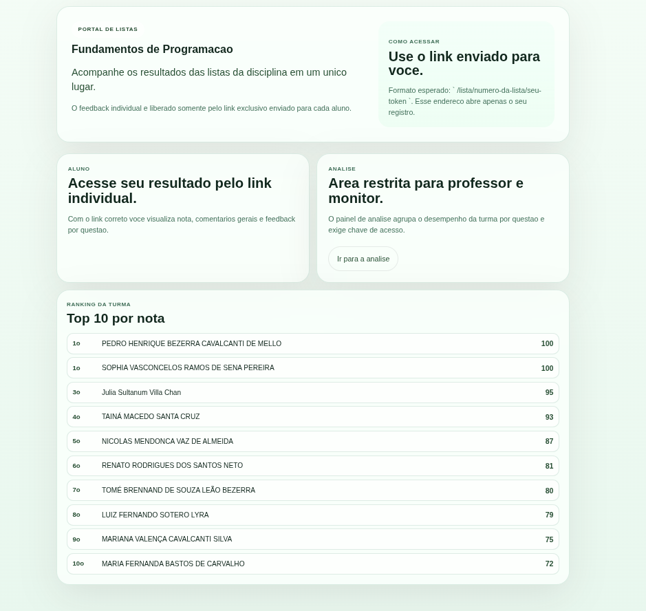
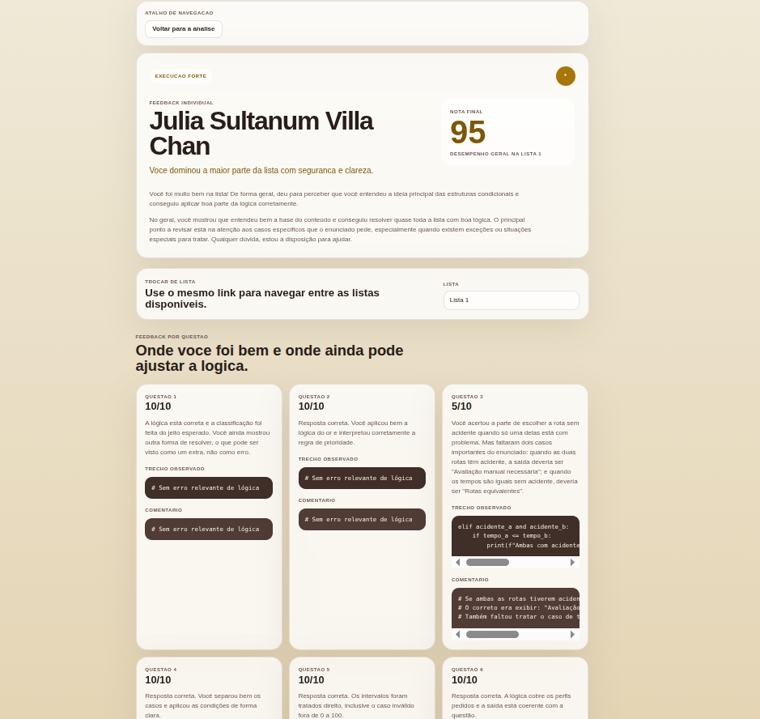
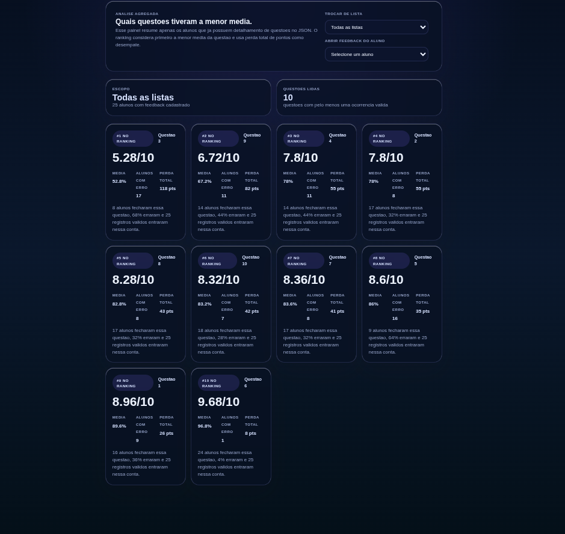

# Feedback App - Fundamentos de Programacao

Aplicacao web para entregar feedback individual das listas de programacao com acesso por link exclusivo de cada aluno.

## Visao geral

Este projeto foi pensado para uso real em turma:

- cada aluno abre apenas seu proprio feedback usando `listId + token`
- professores/monitores acompanham analises agregadas por questao
- o frontend nao recebe todos os alunos
- os dados ficam no backend, com resposta sanitizada

## Principais funcionalidades

- pagina individual de feedback: `/lista/:listId/:token`
- painel de analise por questao: `/analise/questoes`
- ranking da turma no home (top 10 por nota, com empate por colocacao competitiva)
- navegacao entre listas do mesmo aluno com o mesmo token
- pagina inicial explicando o acesso por link exclusivo

## Tecnologias

- frontend: React + Vite
- backend: Node.js + Express
- dados: `backend/src/data/feedbacks.json`

## Estrutura do projeto

```text
feedback-app/
  frontend/
  backend/
```

## Como rodar localmente

### 1. Backend

```bash
cd backend
npm install
cp .env.example .env
npm run dev
```

Backend padrao: `http://localhost:3001`

### 2. Frontend

```bash
cd frontend
npm install
cp .env.example .env
npm run dev
```

Frontend padrao: `http://localhost:5173`

## Rotas importantes

- home: `/`
- aluno: `/lista/:listId/:token`
- analise (restrita): `/analise/questoes`

## Validacao rapida

Backend:

```bash
cd backend
npm test
```

Frontend:

```bash
cd frontend
npm run build
```

## Estado atual

- base com feedbacks reais ja cadastrados no JSON
- painel de analise protegido por chave (`ANALYTICS_ACCESS_KEY`)
- rate limit basico ativo nas rotas de feedback

## Capturas de tela

### Home



### Feedback individual



### Analise de questoes



Coloque os arquivos de imagem nesses caminhos para renderizar no GitHub:

- `docs/screenshots/homepage.png`
- `docs/screenshots/feedback-page.png`
- `docs/screenshots/analytics-page.png`

## Documentacao complementar

Para manter este README objetivo, os detalhes operacionais foram mantidos em arquivos dedicados:

- deploy checklist: [PRE_DEPLOY_CHECKLIST.md](/home/ricobrto/PersonalDevelopment/feedback/feedback-app/PRE_DEPLOY_CHECKLIST.md)
- status do projeto: [PROJECT_STATUS.md](/home/ricobrto/PersonalDevelopment/feedback/feedback-app/PROJECT_STATUS.md)
- seguranca: [SECURITY_TODO.md](/home/ricobrto/PersonalDevelopment/feedback/feedback-app/SECURITY_TODO.md)
- regras do JSON: [JSON_RULES.md](/home/ricobrto/PersonalDevelopment/feedback/feedback-app/JSON_RULES.md)
- template para novos feedbacks: [CONTENT_REQUEST_TEMPLATE.md](/home/ricobrto/PersonalDevelopment/feedback/feedback-app/CONTENT_REQUEST_TEMPLATE.md)
- roadmap de evolucao: [ROADMAP.md](/home/ricobrto/PersonalDevelopment/feedback/feedback-app/ROADMAP.md)
